# 💠 프로젝트명: 방치형 검사 : 닭부터 잡자

귀엽고 유쾌한 SD 전사 캐릭터들이 등장하는 2D 모바일 방치형 RPG 게임으로,

**전설의 검술가가 되기 위해 수련을 시작한 주인공이 닭부터 잡으며 점점 강한 적들과 맞서 싸우는 여정**을 그립니다.

- 🎮 개발 기간: 2025.06.20 ~ 2025.08.14
- 🛠️ 개발 환경: Unity 6000.1.8f1
- 📱 플랫폼: Android (모바일 전용)  
- 💻 PC 환경: WebGL 빌드 제공 (itch.io 통해 브라우저에서 플레이 가능)
  

## 👥 만든 사람들
- [**임예슬**](https://github.com/Imysss)
- [**손채민**](https://github.com/ChaeminSohn)
- [**김경민**](https://github.com/rudals4469)
- [**신희승**](https://github.com/HS-9006)

🤍[팀 노션](https://www.notion.so/teamsparta/13-2172dc3ef51480aa93c9d8b284b36aeb)

🎞️ [시연 영상](https://youtu.be/XhhWhLDwNo4)

## 📂 목차
1. [게임 소개](-게임-소개)
2. [주요 구현 기능](-주요-구현-기능)
3. [기능 명세서](#-기능-명세서)
4. [사용 에셋](#-사용-에셋)

## 🕹️ 게임 소개

- 장르: 2D 모바일 방치형 RPG
- 설명: 점점 더 강해지는 적들을 처치하며 플레이어를 성장시켜 나가는 게임

- 
게임 소개 배너

 

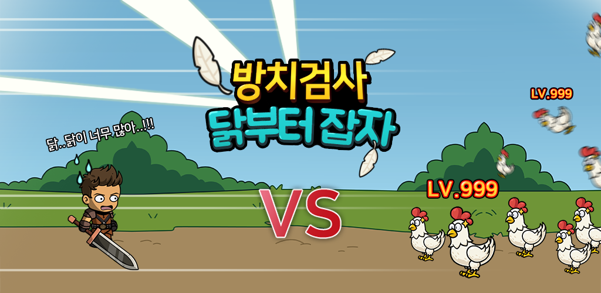
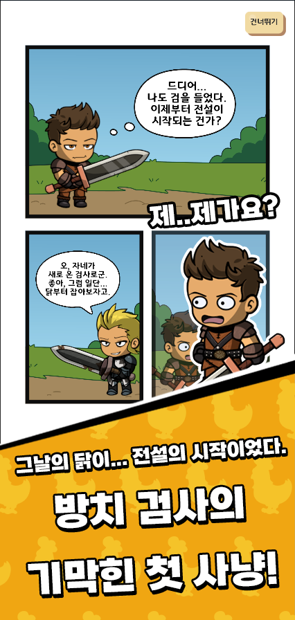 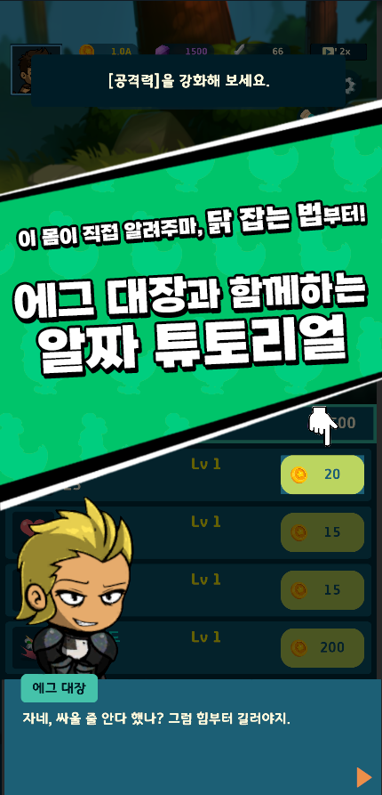
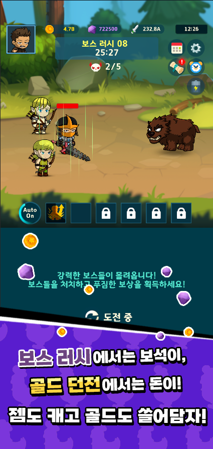 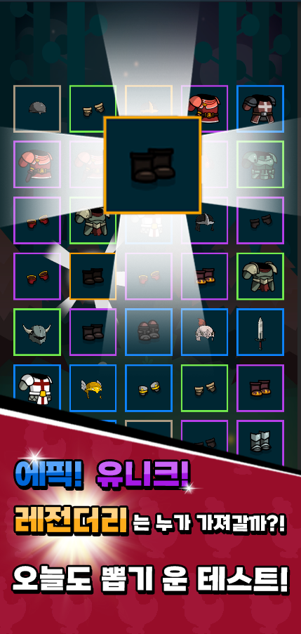
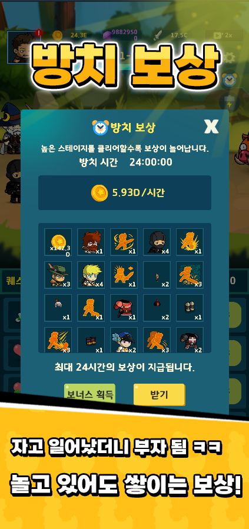

## 🛠️ 주요 구현 기능

- **게임 시스템 및 콘텐츠 루프 완성**
    - 스탯 업그레이드, 장비/스킬/동료 뽑기 및 장착, 자동 스킬 시스템
    - 골드 던전 / 보스 러시 / 방치 보상 / 컷신 기반 튜토리얼 흐름 구현
        → **방치형 RPG의 기본 구조와 콘텐츠 루프를 실현**  
- **Excel 기반 외부 데이터 설계 + 내부 데이터베이스 시스템 구축**
    - 장비/스킬/동료/가챠/퀘스트 등 **모든 데이터를 Excel 기반 테이블로 설계**
    - 이를 내부 **데이터베이스 구조로 연동 및 관리** → **유저의 성장/보유 상태도 저장 가능**
    - 유저의 스탯, 보유 아이템, 게임 진행 상황 등을 **직렬화하여 자동 저장/로드 처리**
- **UI/UX 설계 및 게임 흐름 구현**
    - 버튼 흐름 기반 튜토리얼 + 에그 대장 내레이션으로 유저 가이드
    - 장착 시 외형 변화, 자동 스킬 토글, 가챠 연출 등 직관적이고 몰입감 있는 인터페이스 구성
- **Google Play 출시 준비 및 테스트 중**
    - APK 빌드 및 업로드 테스트 완료
    - 사전 테스트 사용자 피드백을 기반으로 **완성도 개선 및 버그 수정 진행 중**

## 📃 기능 명세서

UML, 기능 정리

  
 

**UI**

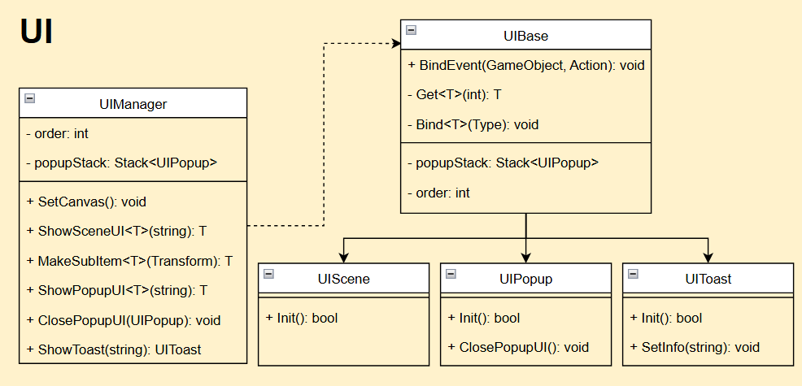

**플레이어, 적**

**스킬**

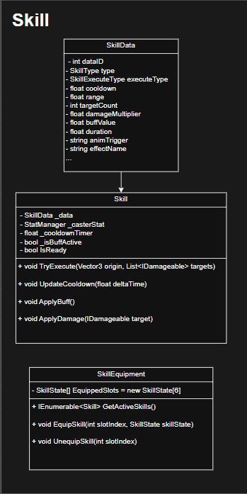

**아이템**

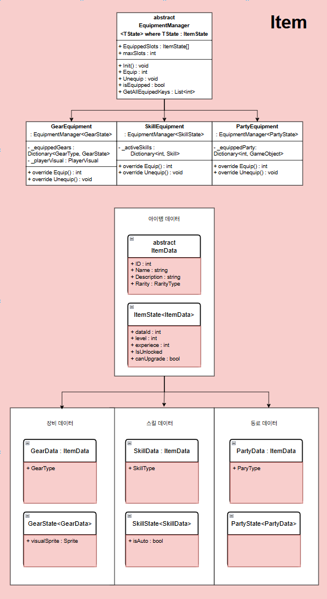

**로그인**

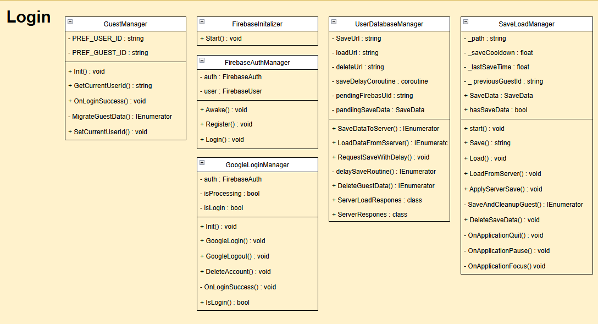

**방치 보상**

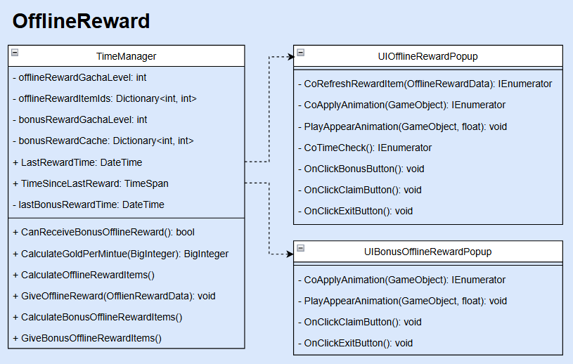

**가챠(뽑기 시스템)**

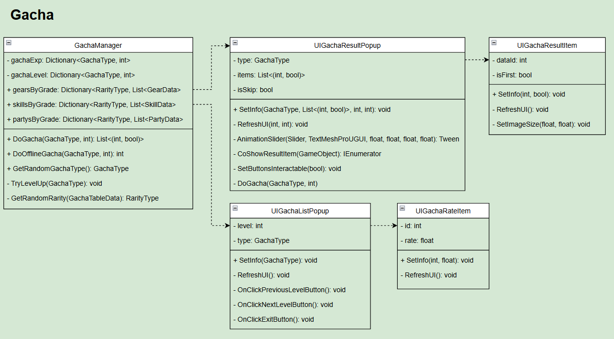

**스탯 강화**

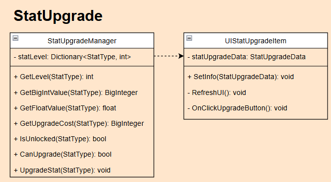

**프로필 수정)**

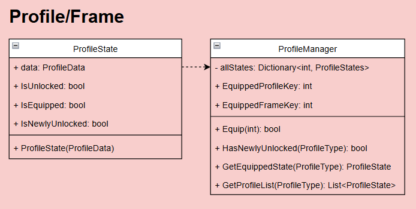

**퀘스트**

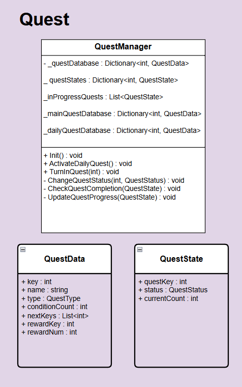

**튜토리얼**

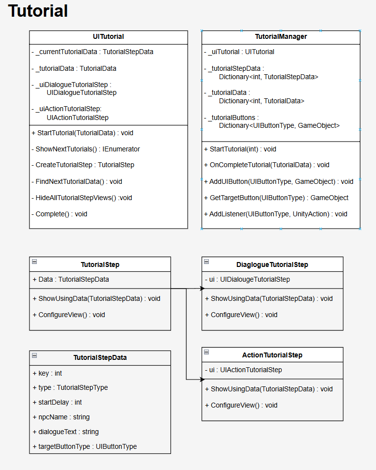

## UI

| 스크립트 | 내용 | 기여자 |
|----------|------|--------|
| [GameManager](#) | 게임 매니저 | 김형중 |
| [SoundManager](#) | 사운드 매니저 | 김형중 |
| [Stage2Manager](#) | Stage 2 관리 | 정재훈, 박지원 |
| [StartStoryUI](#) | 스토리 관리 | 김형중 |
| [GimmickForObject](#) | Stage 3 관리 | 이홍준 |
| [EndingController](#) | 전체 스테이지 클리어 및 엔딩씬 관리 | 박지원, 정재훈 |

## 플레이어, 적

| 스크립트 | 내용 | 기여자 |
|----------|------|--------|
| [BaseController](Scripts/Creature/BaseController.cs) | 공통 전투 로직을 담당하는 추상 클래스 | 김경 |
| [PlayerController](Scripts/Creature/Player/PlayerController.cs) | 플레이어 전용 컨트롤러 | 김경민, 손채민 |
| [EnemyController](Scripts/Creature/Enemy/EnemyController.cs) | 적 유닛 컨트롤러 | 김경민, 손채민 |
| [IAttackable](Scripts/Creature/IAttackable.cs) | 공격 가능한 대상이 구현해야 할 인터페이스 | 김경민 |
| [IDamageable](Scripts/Creature/IDamagable.cs) | 피격 가능한 대상이 구현해야 할 인터페이스 | 김경민 |

### 스킬

| 스크립트 | 내용 | 기여자 |
|----------|------|--------|
| [SkillData](Scripts/Data/SkillData.cs) | 스킬의 정적 에이터 관리 | 김경민 |
| [Skill](Scripts/Item/Skill/Skill.cs) | 런타임에 실제로 동작하는 스킬 인스턴스 관리 | 김경민 |
| [SkillEquipment](Scripts/Item/Skill/SkillEquipment.cs) | 스킬의 장착/해제 관리 | 김경민, 손채민 |승|
| [SkillEquipment](Scripts/Item/Skill/SkillEquipment.cs) | 스킬 아이템 장착/해제  관리 | 손채민, 김경민 |
| [PartyEquipment](Scripts/Item/Party/PartyEquipment.cs) | 동료 아이템 장착/해제 관리 | 손채민 |

### 로그인

| 스크립트 | 내용 | 기여자 |
|----------|------|--------|
| [GuestManager](Scripts/Firebase/GuestManager.cs) | 게스트 로그인 기능| 신희승 |
| [FirebaseInitializer](Scripts/Firebase/FirebaseInitializer.cs) | Firebase SDK 초기화 | 신희승 |
| [GoogleLoginManager](Scripts/Firebase/GoogleLoginManager.cs) | 구글 로그인 | 신희승 |
| [SaveLoadManager](Scripts/Manager/Core/SaveLoadManager.cs) | 사용자 데이터 불러오기, 서버 API 연동 | 신희승, 손채민 |

### 방치 보상

| 스크립트 | 내용 | 기여자 |
|----------|------|--------|
| [TimeManager](Scripts/Manager/Contents/TimeManager.cs) | 시간 관련 기능 관리 | 임예슬, 손채민 |
| [UIOfflineRewardPopup](Scripts/UI/Popup/UIOfflineRewardPopup.cs) | 방치 보상을 보여주는 UI | 임예슬 |
| [UIBonusOfflineRewardPopup](Scripts/UI/Popup/UIBonusOfflineRewardPopup.cs) | 광고 시청 보너스 지급 | 임예슬 |

### 가챠(뽑기 시스템)

| 스크립트 | 내용 | 기여자 |
|----------|------|--------|
| [GachaManager](Scripts/Manager/Contents/GachaManager.cs) | 가챠 시스템 통합 관리 매니저 | 임에슬 |
| [UIGachaResultPopup](Scripts/UI/Popup/UIGachaResultPopup.cs) | 가챠 결과 표시 UI | 임예슬 |
| [UIGachaResultItem](Scripts/UI/SubItem/UIGachaResultItme.cs)) | 가챠 아이템의 정보 표시 UI | 임예슬 |
| [UIGachaListPopup](Scripts/UI/Popup/UIGachaListPopup.cs)) | 가챠 정보 UI | 임예슬 |
| [UIGachaRateItem](Scripts/UI/SubItem/UIGachaRateItem.cs)) | 가챠 확률 테이블 UI | 임예슬 |

### 스탯 강화

| 스크립트 | 내용 | 기여자 |
|----------|------|--------|
| [StatUpgradeManager](Scripts/Manager/Contents/StatUpgradeManager.cs) | 능력치 강화, 강화 상태 저장 |  임예슬 |
| [UIStatUpgradeItem](Scripts/UI/SubItem/UIStatUpgradeItem.cs) | 스탯 강화 UI | 임예슬 |

### 프로필 수정

| 스크립트 | 내용 | 기여자 |
|----------|------|--------|
| [ProfileState](Scripts/Manager/Contents/ProfileManager.cs) | 프로필/프레임의 상태를 저장하는 데이터 구조 | 임예슬 |
| [ProfileManager](Scripts/Manager/Contents/ProfileManager.cs) | 프로필/프레임의 전체 상태 관리자 | 임에슬 |

### 퀘스트

| 스크립트 | 내용 | 기여자 |
|----------|------|--------|
| [QuestManager](Scripts/Manager/Contents/QuestManager.cs) | 퀘스트 시스템 관리 | 손채민 |
| [QuestData](Scripts/Data/QuestData.cs) | 퀘스트의 고정된 정보를 담는 데이터 구조| 손채민 |
| [QuestState](Scripts/Data/QuestState.cs) | 퀘스트의 가변젹 정보를 담는 데이터 구조 | 손채민 |

### 튜토리얼

| 스크립트 | 내용 | 기여자 |
|----------|------|--------|
| [TutorialManager](Scripts/Manager/Contents/TutorialManager.cs) | 튜토리얼 시작, 정보 관리 매니저 | 손채민 |
| [UITutorial](Scripts/Tutorial/UITutorial.cs) | 튜토리얼 UI 관리 | 손채민 |
| [TutorialStep](Scripts/Tutorial/TutorialStep.cs) | 튜토리얼 단계 추상 클래스 | 손채민 |
| [DialougeTutorialStep](Scripts/Tutorial/DialogueTutorialStep.cs) | '대화' 타입의 튜토리얼 단계 | 손채민 |
| [ActionTutorialStep](Scripts/Tutorial/ActionTutorialStep.cs) | '행동' 타입의 튜토리얼 단계 | 손채민 |

## 📦 사용 에셋

- https://assetstore.unity.com/packages/2d/characters/character-editor-fantasy-90592
- https://assetstore.unity.com/packages/2d/characters/fantasy-monsters-animated-megapack-159572
- https://assetstore.unity.com/packages/2d/characters/fantasy-monsters-animated-bosses-300879
- https://assetstore.unity.com/packages/2d/gui/icons/fantasy-inventory-icons-117467
- https://assetstore.unity.com/packages/2d/textures-materials/nature/fantasy-backgrounds-megapack-153154
- https://assetstore.unity.com/packages/2d/gui/idle-game-vertical-ui-kit-315169
- https://assetstore.unity.com/packages/vfx/particles/game-vfx-slash-collection-urp-293636

